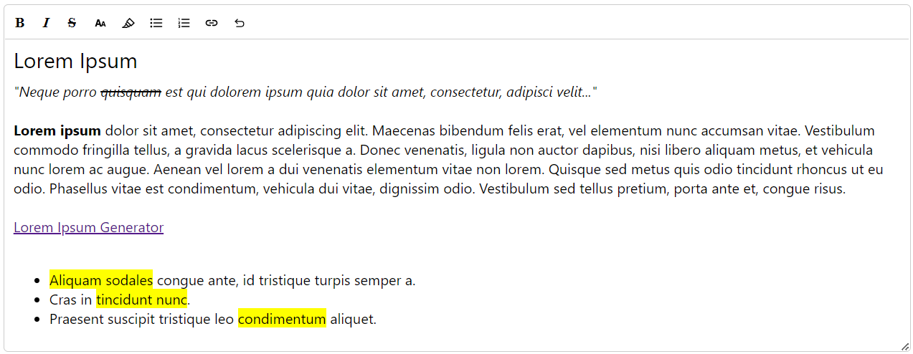
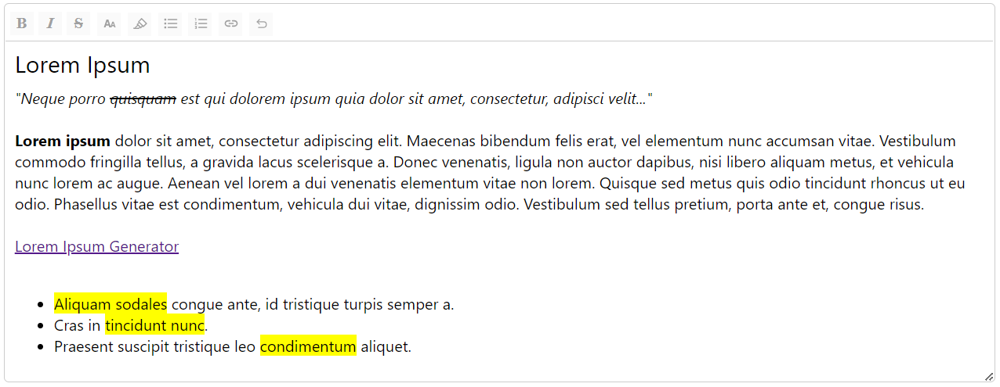

# BCGov Rich Text Editor for React

[](Redirect-URL)
[](LICENSE)

[](NodeJS)
[](Typescript)
[](React)

Originally created by IMB developers working on the [DPIA] product.

<details>
<summary><h2>TL/DR</h2></summary>

1. Install package by following the steps at [Installing the Package](#installing-the-package).
2. Set up the package by following the steps at [Basic Setup Guide](#basic-setup-guide).
3. Output is HTML content in string form, not markdown.

</details>

---

## Table of Contents

- [General Information](#general-information)
- [Installing the Package](#installing-the-package) - **Start Here!**
- [Basic Setup Guide](#basic-setup-guide) - Setting up after installing.
- [Sanitization](#better-than-nothing-sanitization) - How the output is sanitized.

## General Information

- For running on a NodeJS:20 React 18 app.
- Works with Vanilla JavaScript or Typescript 5.
- Output is HTML content in string form, not markdown.

<br />





---

<br />

## Installing the Package

1. Add the following line to your `package.json`:

``` JSON5
{
  "dependencies": {
    "@bcgov/citz-imb-richtexteditor": "https://github.com/bcgov/citz-imb-richtexteditor/releases/download/v<VERSION>/bcgov-citz-imb-richtexteditor-<VERSION>.tgz",
    // The rest of your dependencies...
  },
}
```

2. Replace `<VERSION>` with the version you wish to use. Reference [releases] for version numbers.

<br />

3. Run `npm install` to add the package.

[Return to Top](#bcgov-rich-text-editor-for-react)

<br />

## Basic Setup Guide

1. Add import `import { RichTextEditor } from '@bcgov/citz-imb-richtexteditor';`.

*Example:*

```JavaScript
import React, { useState } from 'react';
import { RichTextEditor } from '@bcgov/citz-imb-richtexteditor';

const MyComponent = () => {
  const [content, setContent] = useState('');
  const [readOnly, setReadOnly] = useState(false);
  return (
    <>
      <RichTextEditor content={content} setContent={setContent} readOnly={readOnly} />
    </>
  );
};
```

[Return to Top](#bcgov-rich-text-editor-for-react)

<br />

## Better Than Nothing Sanitization

The `RichTextEditor` provides a built in function `sanitizeContent` which is designed to take a string containing HTML content and sanitize it by removing potentially malicious code. Here's a summary of what this sanitization handles and what it doesn't:

**What it handles:**

1. **Removal of DOCTYPE and XML declarations:** Removes `<!DOCTYPE ...>` and `<?xml ...?>` declarations.

2. **Removal of `<link>` tags:** `<link>` elements are stripped out, which are often used to include external resources like CSS files that could affect the styling or behavior of the page.

3. **Stripping of inline styles:** It removes any `style` attributes from HTML tags to prevent unwanted styles from being applied.

4. **Removal of potentially harmful tags:** It explicitly removes `<script>`, `<style>`, `<iframe>`, `<form>`, `<object>`, `<embed>`, and `<applet>` tags. These tags can be used to execute JavaScript or embed external resources, which can be a security risk.

5. **Removal of event handlers:** All attributes starting with `on` (like `onclick`, `onerror`, etc.) are removed to prevent JavaScript code execution through event handlers.

6. **Blocking of `javascript:` and `data:` URLs:** These are commonly used in XSS (Cross-Site Scripting) attacks to execute JavaScript or embed data directly into documents.

7. **Removal of XML and namespace attributes:** Attributes like `xmlns` or those starting with `xml` (which are used to define namespaces in XML) are stripped out.

8. **Filtering out non-allowlisted tags:** The function also has a mechanism to loop through the HTML content, removing any tags that are not explicitly listed in the allowlist. Currently these are `"p", "br", "h", "ul", "ol", "li", "b", "i", "s", "u", "a"`.

**What it doesn't handle:**

1. **Limited tag allowlist:** The allowlist is not exhaustive and could potentially filter out valid HTML5 elements which might be considered safe. Also, the code as written allows for any tag starting with "h", which includes all heading tags (`h1` through `h6`) but could inadvertently allow other non-safe tags that start with "h" if not handled correctly.

2. **Potential for obfuscation to bypass sanitization:** The code may not handle all cases of obfuscated JavaScript or other types of obfuscation techniques that could be used to bypass sanitization.

3. **Attribute sanitization:** While it does remove event handlers and specific dangerous attribute values like `javascript:` and `data:`, it doesn't check other attributes for potentially malicious content.

4. **Comments and conditional comments:** The code looks like it's attempting to handle comments, but complex conditional comments could potentially be missed.

5. **Other potential threats:** This sanitization function does not consider other forms of exploits that can be hidden in seemingly benign attributes or tags that are not included in the explicit block list.

In summary, this function takes a series of important steps to sanitize HTML content, particularly aimed at preventing XSS attacks, but it isn't foolproof. 

[Return to Top](#bcgov-rich-text-editor-for-react)

<!-- Link References -->

[releases]: https://github.com/bcgov/citz-imb-richtexteditor/releases
[DPIA]: https://github.com/bcgov/cirmo-dpia
